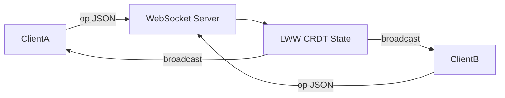

# collab-editor-crdt

Minimal collaborative text editor monorepo: LWW text CRDT on the server, WebSocket sync, React + Vite client.

## Structure

| Package | Description |
|---------|-------------|
| `server/` | `crdt.ts` (LWW CRDT), `server.ts` (WebSocket), Vitest tests |
| `client/` | React + Vite editor UI |
| `scripts/dev.mjs` | Build server and run server + client |

## Quick start

```bash
npm install
npm test
npm run dev
```

Open http://localhost:5173 and run a second tab to see live inserts propagate.

## Architecture



Concurrent edits merge by logical timestamp `(lamport, siteId)` per character position key.

## License

MIT — see [LICENSE](LICENSE).
